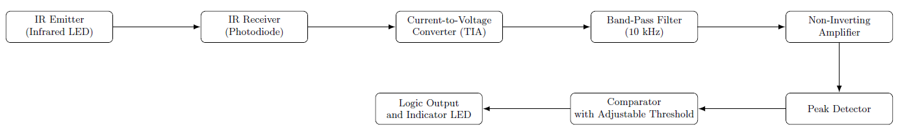

# Infrared Presence Detector – Electronic Design (KiCad)

##  Description
This project focuses on the design of an **active infrared presence detector** based on a
**fully analog signal processing chain**.

The system emits a modulated infrared signal, detects the reflection caused by a nearby object
(human presence), and processes the received signal in order to generate a **usable logic output**.

The project was designed and simulated using **KiCad**, with an **academic and educational purpose**,
following a modular architecture inspired by industrial detection systems.

---

##  Operating Principle

1. An **infrared emitting diode (IR LED)** generates a modulated IR signal.
2. A **photodiode receiver** detects the reflected infrared signal.
3. The received current is converted into a voltage (TIA).
4. A **band-pass filter** rejects ambient noise.
5. The signal is **amplified**.
6. A **peak detector** extracts the signal envelope.
7. A **comparator** compares the signal with an adjustable threshold.
8. A **logic output** indicates the detected presence.

### Functional blocks

